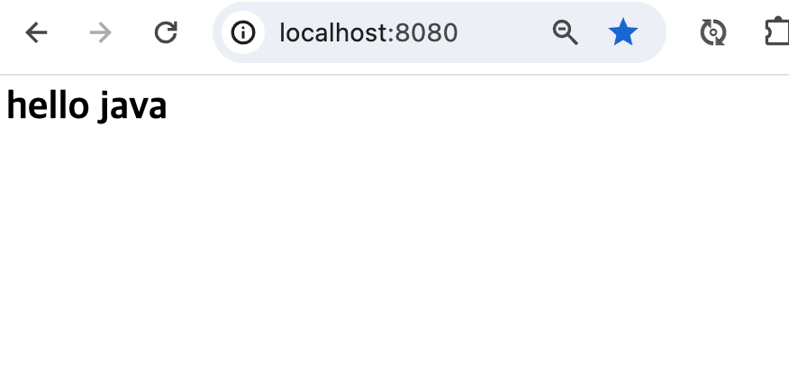

= Single Thread Http Server

* Single Thread 기반 Http Server  만들기

//https://www.syedhussim.com/java/a-simple-http-server-part-1.html

== ServerSocket 생성

* accept는 client가 연결이 설정될 때까지 대기 합니다.

[source,java]
----
ServerSocket serverSocket = new ServerSocket(8080);

for(;;){
    //client 접속할 때 까지 대기
    Socket client = serverSocket.accept();
}
----
* 서버가 수락(accept)하면 읽기(BufferedReader), 쓰기(BufferedWriter)를 할 수 있습니다.

[sourcr,java]
----
BufferedReader bufferedReader = new BufferedReader(new InputStreamReader(client.getInputStream()));
BufferedWriter bufferedWriter = new BufferedWriter(new OutputStreamWriter(client.getOutputStream()))
----

== HTTP Request

[source,httprequest]
----
GET / HTTP/1.1
Host: localhost:8080
Connection: keep-alive
Cache-Control: max-age=0
sec-ch-ua: "Google Chrome";v="123", "Not:A-Brand";v="8", "Chromium";v="123"
sec-ch-ua-mobile: ?0
sec-ch-ua-platform: "macOS"
Upgrade-Insecure-Requests: 1
User-Agent: Mozilla/5.0 (Macintosh; Intel Mac OS X 10_15_7) AppleWebKit/537.36 (KHTML, like Gecko) Chrome/123.0.0.0 Safari/537.36
Accept: text/html,application/xhtml+xml,application/xml;q=0.9,image/avif,image/webp,image/apng,*/*;q=0.8,application/signed-exchange;v=b3;q=0.7
Sec-Fetch-Site: none
Sec-Fetch-Mode: navigate
Sec-Fetch-User: ?1
Sec-Fetch-Dest: document
Accept-Encoding: gzip, deflate, br, zstd
Accept-Language: ko-KR,ko;q=0.9,en-US;q=0.8,en;q=0.7
----

== HTTP Response

[source,httprequest]
----
HTTP/1.1 200 OK
Date: Mon, 27 Jul 2009 12:28:53 GMT
Server: Apache/2.2.14 (Win32)
Last-Modified: Wed, 22 Jul 2009 19:15:56 GMT
Content-Length: 88
Content-Type: text/html
Connection: Closed

<html>
<body>
<h1>Hello, World!</h1>
</body>
</html>
----

== Web Server?
* Web Server는 결국 한 번 연결되고 종료되는 Socket Server
* Http Request(요청), Http Response(응답) 규칙이 있음

== 실습

* SimpleHttpServer를 실행하면 다음과 같이 응답할 수 있도록 구현 합니다.

[source,java]
----
public static void main( String[] args ) throws IOException {
        SimpleHttpServer simpleHttpServer = new SimpleHttpServer(8080);
        simpleHttpServer.start();
}
----

* http://localhost:8080

== 성능 테스트

===  ab - 아파치 웹서버 성능검사 도구
* https://httpd.apache.org/docs/2.4/programs/ab.html

* install

[source,shell]

----
Windows:

> choco install apache-httpd

# source: https://chocolatey.org/packages/apache-httpd

Mac os:
As of macos bigsur ab is installed by default in macos

Ubuntu:

> apt-get install apache2-utils

# source: https://bobcares.com/blog/apache-benchmark-install-ubuntu/
----

* Execute
[source, shell]
----
ab -n 100 http://localhost:8080/
----

[source, shell]
----
This is ApacheBench, Version 2.3 <$Revision: 1903618 $>
Copyright 1996 Adam Twiss, Zeus Technology Ltd, http://www.zeustech.net/
Licensed to The Apache Software Foundation, http://www.apache.org/

Benchmarking localhost (be patient).....done

Server Software:        HTTP
Server Hostname:        localhost
Server Port:            8080

Document Path:          /
Document Length:        45 bytes

Concurrency Level:      1
Time taken for tests:   0.032 seconds
Complete requests:      100
Failed requests:        0
Total transferred:      16300 bytes
HTML transferred:       4500 bytes
Requests per second:    3170.17 [#/sec] (mean)
Time per request:       0.315 [ms] (mean)
Time per request:       0.315 [ms] (mean, across all concurrent requests)
Transfer rate:          504.63 [Kbytes/sec] received

Connection Times (ms)
              min  mean[+/-sd] median   max
Connect:        0    0   0.1      0       0
Processing:     0    0   0.2      0       2
Waiting:        0    0   0.2      0       2
Total:          0    0   0.2      0       2

Percentage of the requests served within a certain time (ms)
  50%      0
  66%      0
  75%      0
  80%      0
  90%      0
  95%      0
  98%      1
  99%      2
 100%      2 (longest request)
----

== Reference
* https://developer.mozilla.org/en-US/docs/Web/HTTP/Messages
* https://www.tutorialspoint.com/http/http_responses.htm
* https://httpd.apache.org/docs/2.4/programs/ab.html
* https://gist.github.com/yolossn/20d86c79745acbd97125b9cca950cbf7